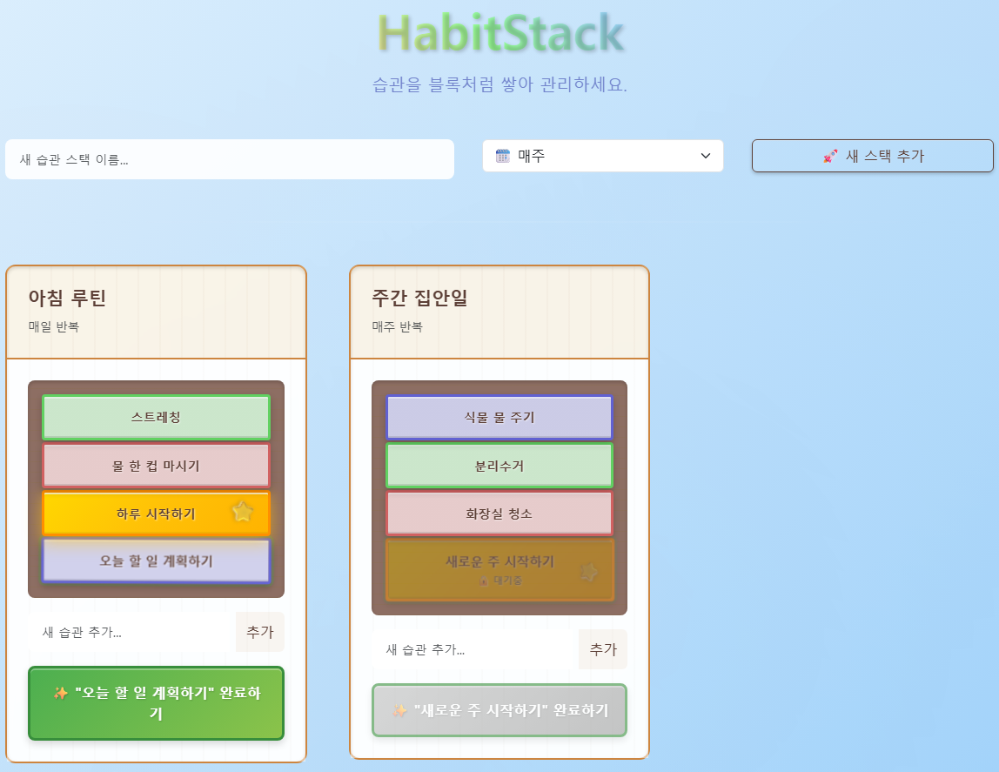

# HabitStack 🚀



## 🔗 서비스 바로가기

[HabitStack 서비스](https://hojun313.github.io/HabitStack/)

**습관을 블록처럼 쌓아 재미있게 관리하는 웹 애플리케이션**

HabitStack은 매일 또는 매주 반복되는 습관들을 시각적인 블록으로 만들어, 게임처럼 즐겁게 습관을 관리하고 목표를 달성할 수 있도록 도와주는 서비스입니다.

## ✨ 주요 기능

### 1. 🎯 습관 스택 관리
- **스택 생성:** '아침 루틴', '주간 운동' 등 원하는 주제의 습관 그룹(스택)을 만들 수 있습니다.
- **반복 주기 설정:** 각 스택마다 '매일' 또는 '매주' 반복 주기를 설정하여 라이프스타일에 맞게 관리할 수 있습니다.

### 2. 🧱 시각적인 습관 블록
- **블록 쌓기:** 스택에 새로운 습관을 추가하면, 마치 블록을 쌓는 것처럼 시각적으로 표시됩니다.
- **직관적인 완료 처리:** 가장 아래에 있는 습관을 완료하면 해당 블록이 맨 위로 올라가는 애니메이션을 통해 성취감을 느낄 수 있습니다.

### 3. 🎨 동적 색상 및 애니메이션
- **아름다운 색상:** 스택 내 습관 개수에 따라 블록 색상이 HSL 색상 모델 기반으로 동적으로 분배되어 언제나 다채로운 시각적 경험을 제공합니다.
- **재미있는 상호작용:** 습관을 완료하고 추가할 때마다 부드럽고 재미있는 애니메이션(완료, 낙하, 재등장)이 실행되어 지루할 틈이 없습니다.

### 4. ⏰ 시간 제한 기능
- **주기적 리셋:** '매일' 반복 스택은 자정이 지나야, '매주' 반복 스택은 월요일이 되어야 특별 블록을 다시 완료할 수 있어 규칙적인 습관 형성을 돕습니다.

### 5. 💾 데이터 저장
- **로컬 저장소:** 모든 데이터는 브라우저의 `localStorage`에 안전하게 저장되어, 언제든 다시 방문해도 기존 데이터를 그대로 사용할 수 있습니다.

## 🛠️ 기술 스택

- **프론트엔드:** React, TypeScript
- **빌드 도구:** Vite
- **스타일링:** Bootstrap, CSS (Custom Animations)
- **상태 관리:** React Hooks (`useState`, `useEffect`, `useRef`)
- **배포:** GitHub Pages

## 🚀 시작하기

1. **저장소 복제:**
   ```bash
   git clone https://github.com/your-username/HabitStack.git
   cd HabitStack/app
   ```

2. **의존성 설치:**
   ```bash
   npm install
   ```

3. **개발 서버 실행:**
   ```bash
   npm run dev
   ```

4. **프로덕션 빌드:**
   ```bash
   npm run build
   ```

## 📝 향후 개선 계획

- [ ] **사용자 인증:** 여러 기기 간 데이터 동기화를 위한 계정 시스템 도입
- [ ] **통계 기능:** 습관 완료 이력 및 성취도 분석 기능 추가
- [ ] **알림 시스템:** 사용자가 설정한 시간에 맞춰 습관 리마인더 전송
- [ ] **테마 시스템:** 사용자가 직접 UI 테마를 선택하고 커스터마이징하는 기능
- [ ] **데이터 내보내기/가져오기:** 사용자가 자신의 데이터를 백업하고 복원하는 기능